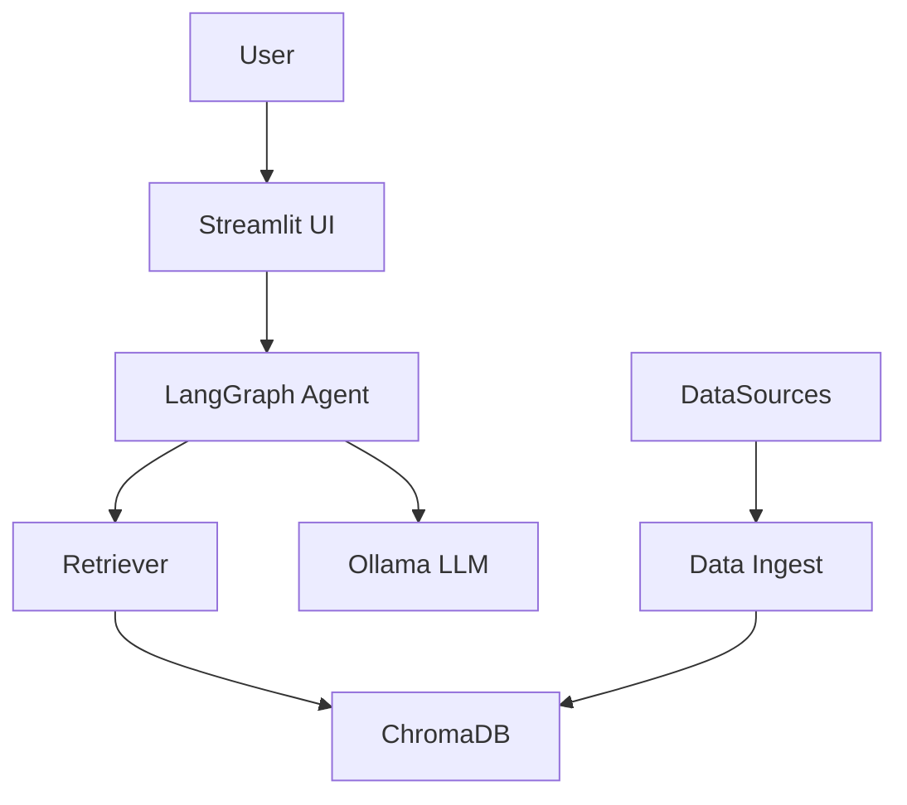

# LexIQ

LexIQ is a locally-running legal research assistant designed for lawyers, paralegals, and legal assistants.

## Project overview

LexIQ provides a retrieval-augmented generation (RAG) pipeline over federal case law, statutes, and regulations. It runs entirely locally using Ollama for LLM inference and ChromaDB for vector storage.

LexIQ's architecture includes: a data ingestion layer (CourtListener, USGPO, eCFR), a retriever/indexer using ChromaDB, an embedder using sentence-transformers, a LangGraph-style agent for routing, and a Streamlit UI with pages for chat, document workspace, statute/regulation lookup, case explorer, and evaluation.



## Prerequisites

- Install Ollama and pull `llama3.1:8b` (or another local model).
- Register free API keys for CourtListener, Congress.gov, and GovInfo.gov.
  - CourtListener API docs: https://www.courtlistener.com/help/api/
  - Congress.gov API: https://api.congress.gov/
  - GovInfo API: https://api.govinfo.gov/

## Quickstart

Make a virtualenv and install dependencies:

```bash
make install
make setup
make app
```

## Data Sources

- CourtListener (Free Law Project) — case opinions
- GovInfo / US Code — statutes XML bulk
- eCFR — Code of Federal Regulations (live API)

PACER and Westlaw are NOT used.

## Usage

- Chat: Ask legal research questions and receive sourced answers.
- Case Law Explorer: Browse indexed cases.
- Document Workspace: Upload session files and query/compare.
- Statute & Regulation Lookup: Search USC and CFR.
- Evaluation Dashboard: Run benchmarks and inspect metrics.

## Data Refresh

Use the Data Refresh page to fetch and re-index new opinions, statutes, or CFR titles.

## Tech Stack

- Python 3.11+, Streamlit, Ollama, ChromaDB, sentence-transformers

## Evaluation

Benchmarks run a suite of questions against the agent and score using an Ollama-based judge.

## Legal disclaimer

LexIQ is a research tool only. It does not provide legal advice.
