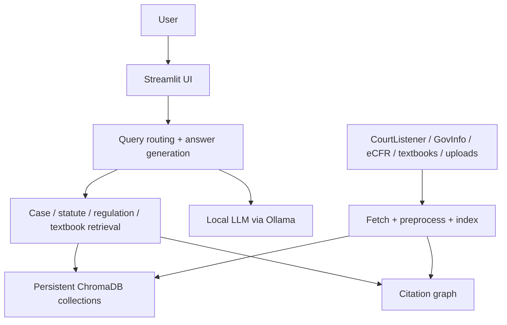

# LexIQ

LexIQ is a local-first legal research assistant for case law, statutes, regulations, and textbooks.
It runs against a local Ollama model, stores sources in ChromaDB, and exposes the system
through a Streamlit app with search, chat, document, and evaluation workflows.

## What it does

- Searches and answers questions over federal case law, U.S. Code, CFR, textbooks, and uploaded documents.
- Prioritizes case sources in the answer prompt when case law is available.
- Uses retrieval expansion, reranking, citation graph expansion, and source trimming to reduce noisy context.
- Shows which sources were retrieved versus actually used in the prompt.
- Supports incremental data refresh and re-indexing from the UI.

## Current system shape



The current answer pipeline is case-first when cases exist. The agent also performs a
conversational repair pass if the first draft fails to use the retrieved case source or
introduces citations that were not provided in the source set.

## Repository layout

```text
src/
  config.py                 # Environment settings and defaults
  observability/logger.py    # Structured JSON logging
  data/                     # CourtListener, GovInfo, eCFR, preprocessing
  rag/                      # Embedder, reranker, indexer, retriever, citation graph
  agent/                    # Routing, retrieval orchestration, citations
  documents/                # Upload parsing, session store, comparison
  evaluation/               # Judge, benchmarks, metrics
streamlit_app.py            # Main chat UI
pages/                     # Explorer, document workspace, lookup, eval, refresh
scripts/setup_full.py      # Full fetch / preprocess / index / graph build CLI
scripts/setup_citation_graph.py # Graph rebuild-only CLI
tests/                     # Unit tests
```

Generated or rebuildable artifacts live in `chroma_db/`, `data/raw/`, `data/processed/`,
and `logs/`.

## Setup

### 1. Install dependencies

```bash
make install
```

This creates `.venv` and installs the Python dependencies.

### 2. Fetch and index data

```bash
make setup
```

This fetches and indexes the default corpora and also builds the citation graph:

- CourtListener case law
- U.S. Code granules, if `GOVINFO_API_KEY` is available
- eCFR titles
- Preprocessing and ChromaDB indexing
- Citation graph construction

If you already have the raw and processed data in place and only want to refresh the graph, run:

```bash
make setup-citation-graph
```

To process only the local textbook PDFs and add them to the shared index, run:

```bash
make setup-textbooks
```

### 3. Start Ollama

```bash
ollama serve
```

Keep this running while using the app.

### 4. Run the app

```bash
make app
```

Or, if you want to run Streamlit directly:

```bash
source .venv/bin/activate
streamlit run streamlit_app.py
```

For larger or smaller local corpora, use the custom setup target:

```bash
make setup-custom CASES=500 GRANULES=500 ECFR_TITLES=500
```

Under the hood this calls `scripts/setup_full.py`, which also supports:

```bash
.venv/bin/python scripts/setup_full.py --cases 1000 --granules 500 --ecfr-titles 10
```

## Optional configuration

Copy `.env.example` to `.env` if you want to set optional API keys or override defaults.

Available settings include:

- `OLLAMA_MODEL`, `OLLAMA_BASE_URL`
- `EMBED_MODEL`, `RERANK_MODEL`
- `COURTLISTENER_API_KEY`, `GOVINFO_API_KEY`, `CONGRESS_API_KEY`
- `ENABLE_CITATION_GRAPH`, `CITATION_GRAPH_HOPS`, `CITATION_GRAPH_MAX_NODES`
- `RETRIEVAL_MIN_DISTANCE`, `RERANK_MIN_SCORE`
- `OLLAMA_TEMPERATURE`, `OLLAMA_TOP_P`, `OLLAMA_TOP_K`
- `MAX_DOCS_PER_TOOL`, `MAX_NON_CASE_DOCS_PER_TOOL`, `MAX_CASE_REPAIR_ATTEMPTS`
- `ENABLE_QUERY_EXPANSION`, `MIN_RETRIEVED_RESULTS`, `REQUIRE_SOURCES`

The defaults are tuned for grounded legal answers rather than creative generation.

## UI pages

### Main chat

- Asks legal research questions in natural language.
- Displays source badges showing `USED` versus `RETRIEVED`.
- Prefers case sources first when cases are available.
- Shows citations and query coverage stats.

### Case Law Explorer

- Searches indexed CourtListener opinions.
- Filters and previews the retrieved opinion text.

### Document Workspace

- Upload PDF, DOCX, or TXT files.
- Search uploaded documents against case law, statutes, and regulations.
- Compare documents with an LLM-generated analysis.

### Statute & Regulation Lookup

- Search U.S. Code and CFR content separately.
- Preview citations, headings, and full text snippets.

### Evaluation Dashboard

- Run retrieval-oriented benchmarks.
- Review historical benchmark runs.

### Data Refresh

- Incrementally fetch new court opinions, U.S. Code granules, and CFR titles.
- Optionally reprocess, reindex, and rebuild the citation graph after refresh.

## Grounding and retrieval behavior

LexIQ currently uses a few layers to keep responses closer to the sources:

- Query expansion for a curated set of legal topics.
- BM25 lexical fallback alongside dense retrieval.
- Reranking to prefer stronger candidates.
- Citation graph expansion for sources linked by citations or statutory/regulatory references.
- Case grouping so one opinion does not swamp the prompt with duplicate chunks.
- A smaller non-case prompt budget so statutes, regulations, and textbooks do not crowd out cases.
- An LLM repair pass when the draft answer omits the retrieved case or cites unsupported authorities.

This is designed to improve answer quality without forcing deterministic templates into the final output.

## Running tests

```bash
make test
```

or:

```bash
.venv/bin/pytest -q
```

The repo includes tests for agent routing, retrieval behavior, citations, document comparison,
evaluation parsing, citation graph construction, and UI helper utilities.

## Troubleshooting

- If Ollama is not running, start it with `ollama serve`.
- If U.S. Code fetch is skipped, check whether `GOVINFO_API_KEY` is set.
- If the index looks stale or corrupted, run `make clean && make setup`.
- If the citation graph looks stale, run `make setup-citation-graph`.
- If imports fail, reinstall with `make install`.

## Legal note

LexIQ is a research tool, not legal advice.
